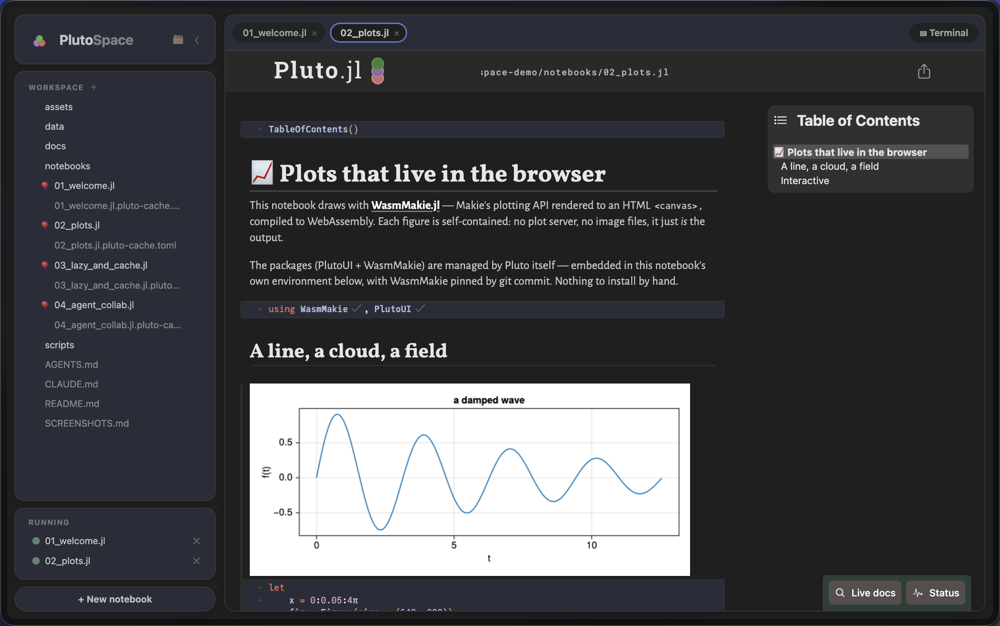
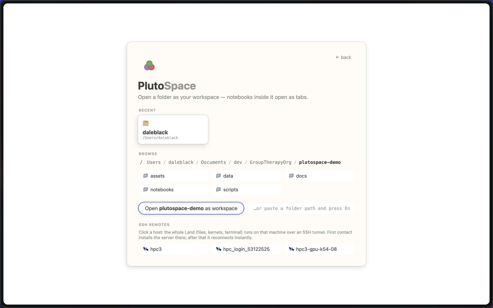
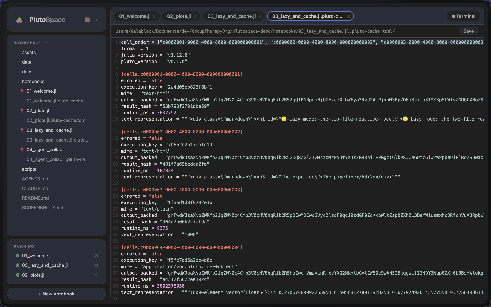
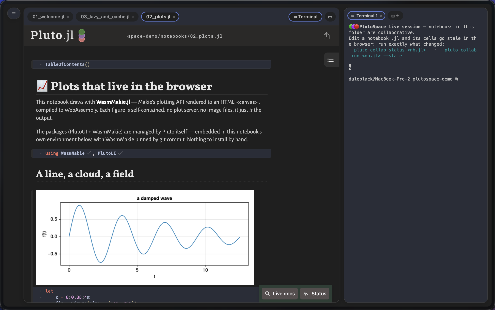
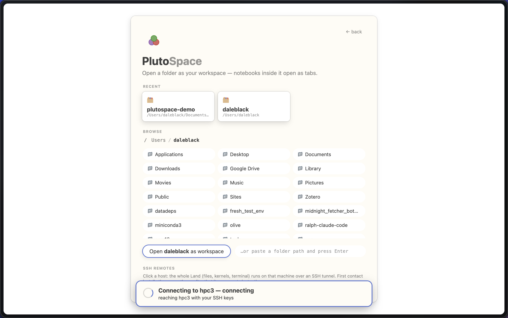
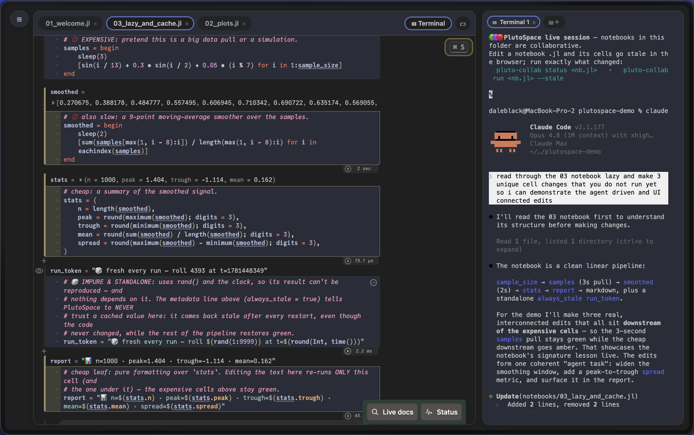
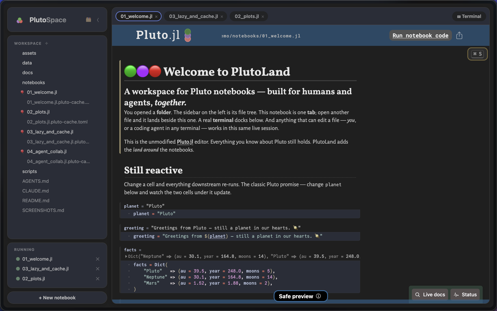
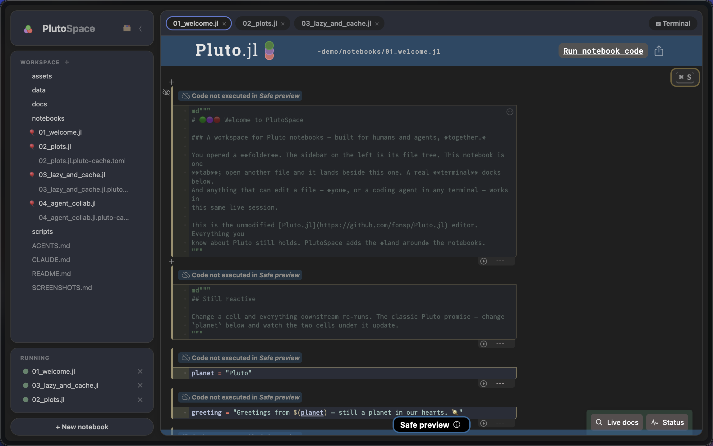

<div align="center">

<h1>

&nbsp;PlutoSpace.jl
</h1>

### A workspace for Pluto notebooks — built for humans and agents, *together.*

[Pluto.jl](https://github.com/fonsp/Pluto.jl) gives you a reactive notebook.
**PlutoSpace gives you the *space* around it:** a folder workspace, tabbed notebooks and files,
a real terminal, point-and-click SSH remotes, outputs that survive restarts, and first-class
**human + agent collaboration** on one live session — all on the unmodified Pluto editor.

<br>



</div>

## Install & run

PlutoSpace installs as a **Julia [Pkg App](https://pkgdocs.julialang.org/dev/apps/)** — one command
puts a real `plutospace` executable on your `PATH`, so it launches like any CLI tool (no
`julia -e …`, no manual `import`):

```julia
julia> import Pkg; Pkg.Apps.add(url="https://github.com/GroupTherapyOrg/PlutoSpace.jl")
```

```sh
$ plutospace               # workspace picker
$ plutospace ~/project     # open a folder as a workspace
$ plutospace notebook.jl   # open a single notebook
$ plutospace --help
```

Prefer it as a library? `import PlutoSpace; PlutoSpace.run()` works too (every `Pluto.run` keyword
applies). Lazy/collab mode is the default; add `--autorun` for classic Pluto reactivity.

> Want to try everything below hands-on? There's a ready-made demo workspace with a guided
> shot list: **[plutospace-demo](https://github.com/GroupTherapyOrg/plutospace-demo)**.

---

# What PlutoSpace adds to Pluto

Everything in this section is something **vanilla Pluto doesn't have.** The notebook engine,
editor, reactivity, `@bind`, packages, and the `.jl` file format are all Pluto's — and notebooks
stay **byte-for-byte compatible in both directions.** PlutoSpace only adds the space around them.

| | |
|---|---|
| 📁 [Open a folder as a workspace](#-open-a-folder-as-a-workspace) | 🪟 [Notebooks & files are tabs](#-notebooks-and-files-are-tabs) |
| 💻 [A real, persistent terminal](#-a-real-persistent-terminal) | 🌐 [SSH remote workspaces](#-ssh-remote-workspaces) |
| 🤝 [Lazy mode — humans + agents, one session](#-lazy-mode-humans-and-agents-on-one-live-session) | 💾 [Two files; outputs survive restarts](#-two-files-and-outputs-that-survive-restarts) |

---

## 📁 Open a folder as a workspace

PlutoSpace starts where an IDE does: a **VS Code-style "Open Folder"** hub with recent
workspaces, a filesystem browser, and (if you have SSH hosts) one-click remotes. Pick a folder
and its file tree becomes your sidebar — notebooks and files open as tabs beside it.

<div align="center">

</div>

---

## 🪟 Notebooks and files are tabs

Notebooks open as tabs — each one the **unmodified Pluto editor** in its own session. Plain
files open in tabs too, edited with the same CodeMirror — including the per-notebook
`*.pluto-cache.toml` sidecar, which is just readable TOML. Add and delete files right from the tree.

<div align="center">

</div>

---

## 💻 A real, persistent terminal

An integrated **PTY shell** runs in the workspace folder. Dock it bottom, right, or as an editor
tab; and — unlike a browser terminal — it's a **persistent session**: refresh the page and the
shell keeps running, replaying its scrollback on reconnect (tmux semantics, no tmux). It also
exports `PLUTOSPACE_PORT`/`PLUTOSPACE_SECRET` and puts `pluto-collab` on `PATH`, so a coding agent
launched here just works.

<div align="center">

</div>

---

## 🌐 SSH remote workspaces

Click a host from your `~/.ssh/config` and the **entire workspace** — files, kernels, terminal, the
agent API — runs on that machine over an SSH tunnel. First contact installs PlutoSpace on the
remote; after that it reconnects instantly. The VS Code Remote-SSH model, with zero config beyond
your SSH setup.

<div align="center">

</div>

---

## 🤝 Lazy mode: humans and agents on one live session

This is the one that's hard to fake. PlutoSpace's default isn't autorun: editing a cell — **in the
browser *or* on disk** — marks it (and everything downstream) **stale** instead of running it, so a
run executes **exactly the stale closure and nothing more.** That makes it safe for a human in the
browser and **any coding agent in any terminal** to work on the **same live notebook** at once —
same kernel, same state. The agent edits the `.jl` with its normal file tools; the human watches
those cells go **amber within a second**, then runs them. No MCP, no plugins.

<div align="center">

</div>

The whole agent surface is boring plumbing:

- a **connection file** at `~/.local/state/pluto/servers/<port>.json` (port + secret — the Jupyter idiom),
- a plain **HTTP API** at `/api/v1/…`,
- the [`pluto-collab`](bin/pluto-collab) CLI (just `curl` + `sed`):

```sh
pluto-collab status notebook.jl          # per-cell: stale / cold / errored / output
pluto-collab run    notebook.jl --stale  # run exactly what's outdated (blocking; exit 1 on error)
```

Runs requested over HTTP go through the **same execution queue** as browser clicks — both sides see
each other's cells turn amber → running → green live. Staleness is verified against content-addressed
**execution keys**, so reverting an edit un-stales a cell with no run at all. See
**[COLLAB.md](COLLAB.md)** for the full story and an `AGENTS.md` stanza you can drop into any repo.

---

## 💾 Two files, and outputs that survive restarts

Every notebook is **two files**: the `.jl` (your code — the source of truth, unchanged from vanilla
Pluto) and a plain-TOML **`<notebook>.jl.pluto-cache.toml`** sidecar holding every cell's output plus
its execution key. That sidecar is the whole trick: reopen a notebook and **every output is restored
instantly** from it — no recompute. Vanilla Pluto has no output persistence; it either re-runs
everything on open or shows nothing.

<table>
<tr>
<td width="50%"></td>
<td width="50%"></td>
</tr>
<tr>
<td align="center"><em><strong>With</strong> the sidecars → outputs restored on open</em></td>
<td align="center"><em><strong>Without</strong> them → "Code not executed" (plain Pluto)</em></td>
</tr>
</table>

<div align="center"><em>Same notebook, same fresh restart — the sidecar is the whole difference. Restored cells are trusted <strong>only when their execution keys prove</strong> the code and upstream results are unchanged; impure cells (<code>rand()</code>, the clock, I/O) opt out with <code>always_stale = true</code>.</em></div>

---

## Relationship to Pluto.jl

PlutoSpace is a friendly fork of [Pluto.jl](https://github.com/fonsp/Pluto.jl). The notebook engine,
editor, file format, and reactivity are Pluto's, and notebooks remain fully compatible in both
directions. For everything about notebooks themselves (reactivity, `@bind`, packages, exporting),
see the [Pluto documentation](https://plutojl.org/). 🎈

PlutoSpace adds the *space around* the notebooks: workspaces, tabs, terminal, remotes, persistence,
and first-class human + agent collaboration. `--autorun` gives you classic Pluto reactivity
whenever you want it, byte-for-byte.

## License

MIT — see [LICENSE](LICENSE). Pluto.jl is by Fons van der Plas and contributors.
