<div align="center">


# PlutoLand.jl

### A workspace for Pluto notebooks — built for humans and agents, *together.*

[Pluto.jl](https://github.com/fonsp/Pluto.jl) gives you a reactive notebook.
**PlutoLand gives you the *land* around it:** a folder workspace, tabbed notebooks and files,
a real terminal, point-and-click SSH remotes, outputs that survive restarts, and first-class
**human + agent collaboration** on one live session — all on the unmodified Pluto editor.

<br>

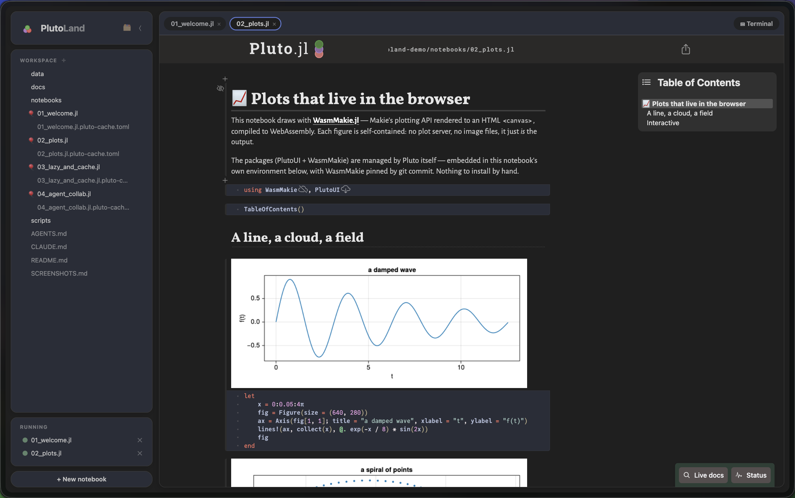

</div>

## Install & run

PlutoLand installs as a **Julia [Pkg App](https://pkgdocs.julialang.org/dev/apps/)** — one command
puts a real `plutoland` executable on your `PATH`, so it launches like any CLI tool (no
`julia -e …`, no manual `import`):

```julia
julia> import Pkg; Pkg.Apps.add(url="https://github.com/GroupTherapyOrg/PlutoLand.jl")
```

```sh
$ plutoland               # workspace picker
$ plutoland ~/project     # open a folder as a workspace
$ plutoland notebook.jl   # open a single notebook
$ plutoland --help
```

Prefer it as a library? `import PlutoLand; PlutoLand.run()` works too (every `Pluto.run` keyword
applies). Lazy/collab mode is the default; add `--autorun` for classic Pluto reactivity.

> Want to try everything below hands-on? There's a ready-made demo workspace with a guided
> shot list: **[plutoland-demo](https://github.com/GroupTherapyOrg/plutoland-demo)**.

---

# What PlutoLand adds to Pluto

Everything in this section is something **vanilla Pluto doesn't have.** The notebook engine,
editor, reactivity, `@bind`, packages, and the `.jl` file format are all Pluto's — and notebooks
stay **byte-for-byte compatible in both directions.** PlutoLand only adds the land around them.

| | |
|---|---|
| 🗂️ [Folder workspaces](#-open-a-folder-not-a-notebook) | 🪟 [Notebooks & files as tabs](#-everything-is-a-tab) |
| ⌨️ [A real, persistent terminal](#-a-real-terminal-that-survives-refreshes) | 🌐 [SSH remote workspaces](#-ssh-remote-workspaces--point-and-click) |
| 🟡 [Lazy mode: run what changed](#-lazy-mode-edits-mark-cells-stale-you-run-what-changed) | 🗃️ [Two files: code + a cache sidecar](#-two-files-per-notebook-code--an-output-sidecar) |
| ♻️ [Outputs survive restarts](#-outputs-survive-a-restart--verified-not-guessed) | 🤝 [Humans + agents, one live session](#-humans-and-agents-on-one-live-session) |

---

## 🗂️ Open a *folder*, not a notebook

PlutoLand starts where an IDE does: a **VS Code-style "Open Folder"** hub with recent
workspaces, a filesystem browser, and (if you have SSH hosts) one-click remotes. Pick a folder
and its file tree becomes your sidebar — notebooks and files open as tabs beside it.

<div align="center">
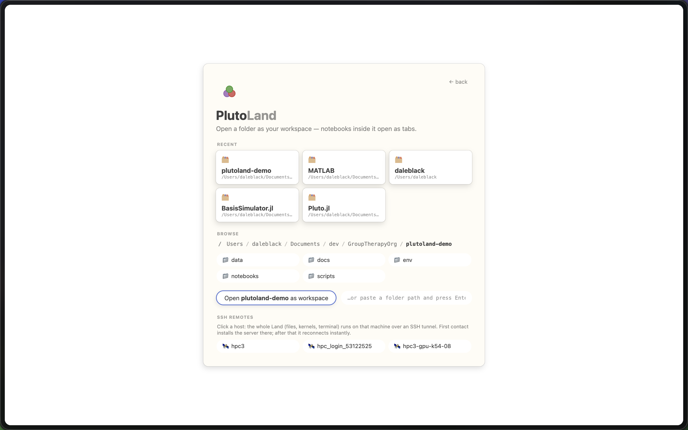
</div>

---

## 🪟 Everything is a tab

Notebooks open as tabs — each one the **unmodified Pluto editor** in its own session. Plain
files (Markdown, CSV, scripts) open in tabs too, edited with the same CodeMirror. Add and delete
files right from the tree.

<table>
<tr>
<td width="50%">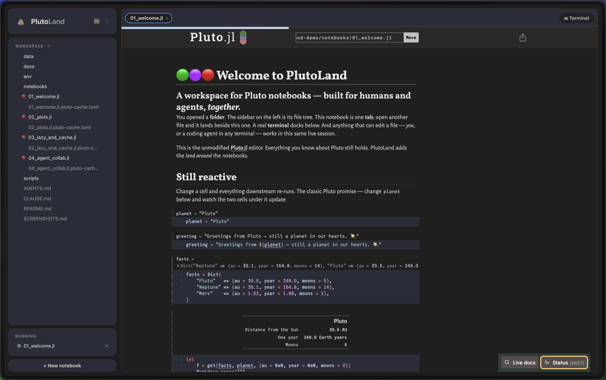</td>
<td width="50%">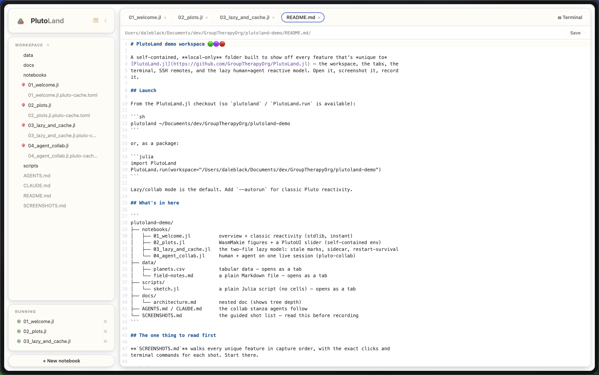</td>
</tr>
<tr>
<td align="center"><em>A notebook tab — the real Pluto editor, still fully reactive</em></td>
<td align="center"><em>A plain file tab — same editor, no cells</em></td>
</tr>
</table>

---

## ⌨️ A real terminal that survives refreshes

An integrated **PTY shell** runs in the workspace folder. Dock it right or bottom, resize it,
and — unlike a browser terminal — it's a **persistent session**: refresh the page and the shell
keeps running, replaying its scrollback on reconnect (tmux semantics, no tmux).

<div align="center">
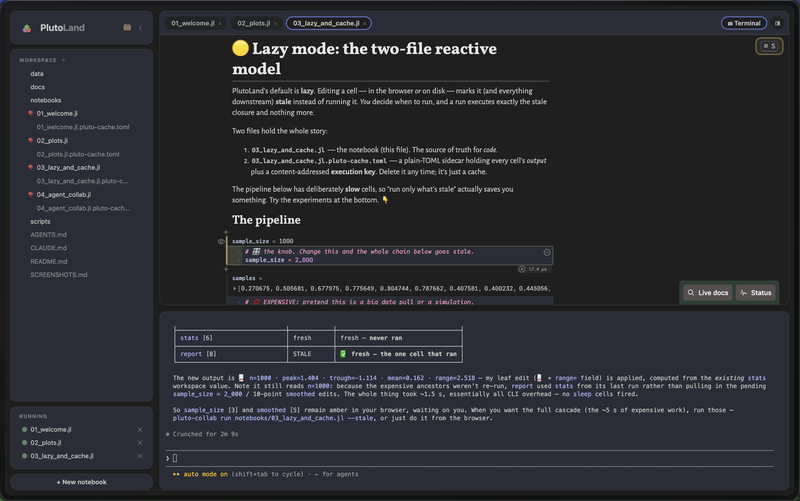
</div>

---

## 🌐 SSH remote workspaces — point and click

Click a host from your `~/.ssh/config` and the **entire Land** — files, kernels, terminal, the
agent API — runs on that machine over an SSH tunnel. First contact installs PlutoLand on the
remote; after that it reconnects instantly. The VS Code Remote-SSH model, with zero config beyond
your SSH setup.

<div align="center">
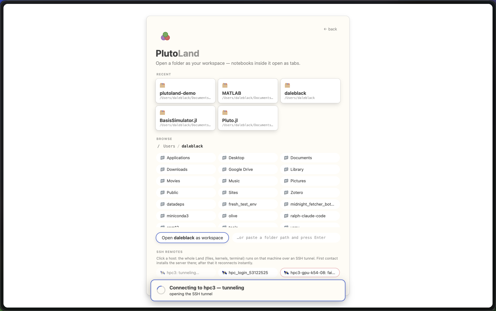
</div>

---

## 🟡 Lazy mode: edits mark cells *stale*, you run what changed

PlutoLand's default isn't autorun. Editing a cell — **in the browser *or* on disk** — marks it
(and everything downstream) **stale** instead of running it. *You* decide when to run, and a run
executes **exactly the stale closure and nothing more.** Expensive, unrelated cells are never
touched.

<div align="center">
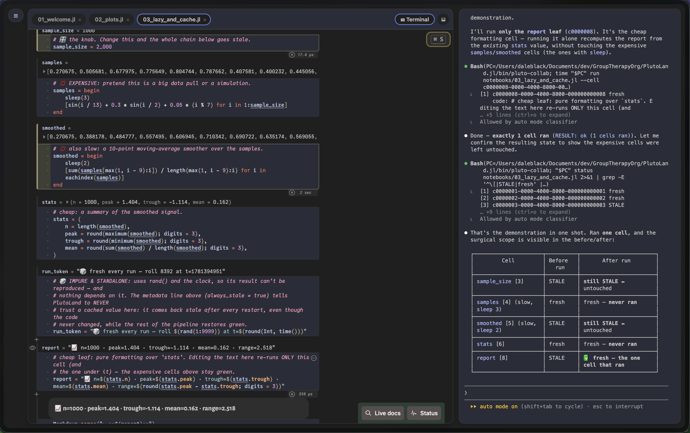
</div>

<div align="center"><em>Edit a cheap leaf and run it — the slow upstream cells stay green. Staleness is verified against content-addressed <strong>execution keys</strong>, so reverting an edit un-stales a cell with no run at all.</em></div>

---

## 🗃️ Two files per notebook: code + an output sidecar

Every notebook is **two files**: the `.jl` (your code — the source of truth, unchanged from
vanilla Pluto) and a plain-TOML **`<notebook>.jl.pluto-cache.toml`** holding every cell's output
plus its execution key. It's a deletable cache *and* a machine-readable view of all results — any
tool can read outputs without running anything.

<div align="center">
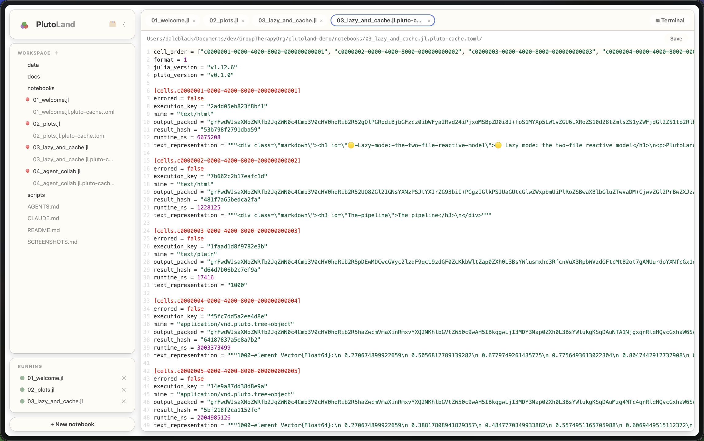
</div>

---

## ♻️ Outputs survive a restart — verified, not guessed

Reopen a notebook and **every output is restored instantly** from the sidecar — no recompute.
Vanilla Pluto has no output persistence at all: it either re-runs everything on open, or shows
nothing. Restored cells are trusted **only when their execution keys prove** the code and all
upstream results are unchanged.

<table>
<tr>
<td width="50%">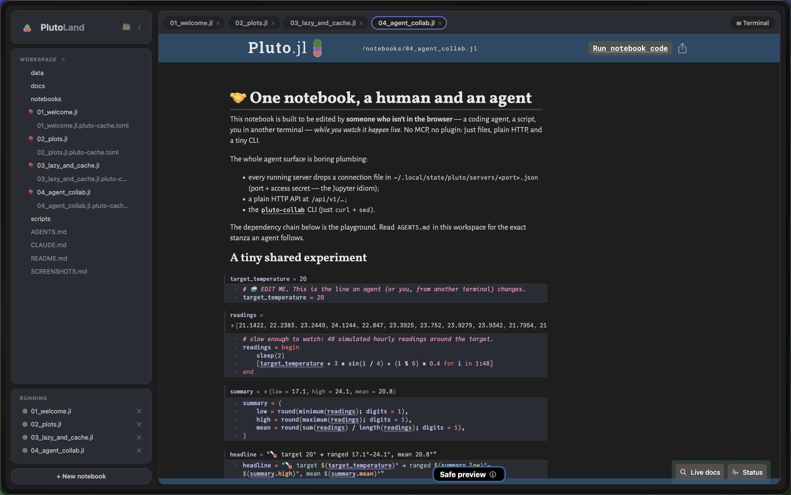</td>
<td width="50%">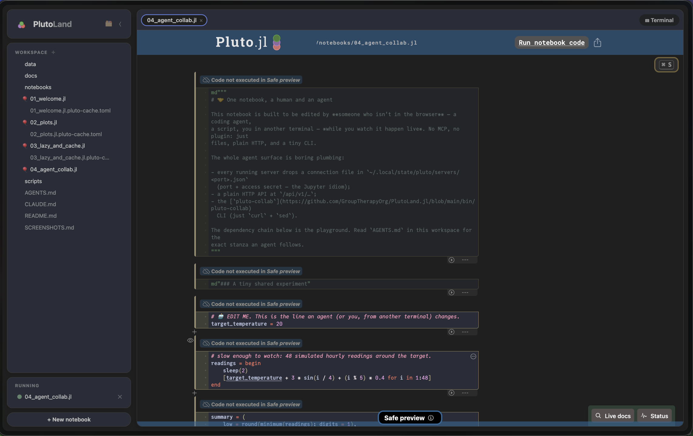</td>
</tr>
<tr>
<td align="center"><em><strong>With</strong> the sidecar → outputs restored, instantly</em></td>
<td align="center"><em><strong>Without</strong> it → "Code not executed" (plain Pluto)</em></td>
</tr>
</table>

<div align="center"><em>The same notebook, same fresh restart — the sidecar is the whole difference. Impure cells (<code>rand()</code>, the clock, I/O) opt out with <code>always_stale = true</code>, so their cached values are never trusted across restarts.</em></div>

---

## 🤝 Humans and agents on one live session

This is the one that's hard to fake: a human in the browser and **any coding agent in any
terminal** work on the **same live notebook** — same kernel, same state, both sides watching in
real time. The agent edits the `.jl` with its normal file tools; the human sees those cells go
**amber within a second.** No MCP, no plugins — just files, plain HTTP, and a tiny CLI.

<div align="center">
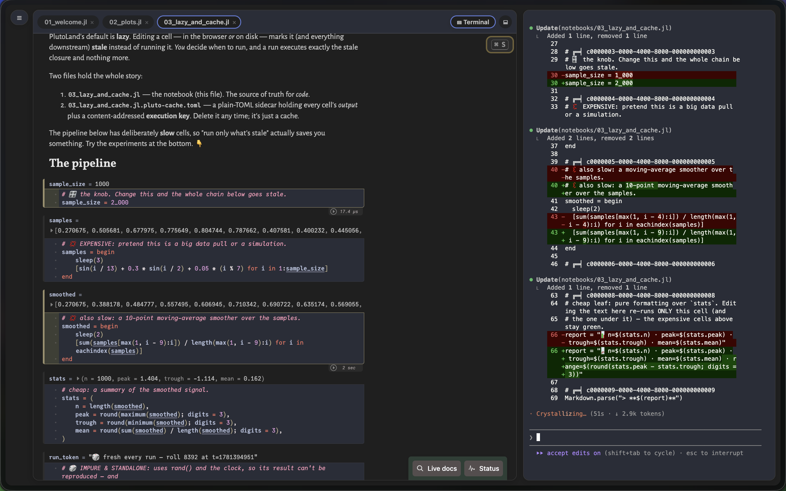
</div>

The whole agent surface is boring plumbing:

- a **connection file** at `~/.local/state/pluto/servers/<port>.json` (port + secret — the Jupyter idiom),
- a plain **HTTP API** at `/api/v1/…`,
- the [`pluto-collab`](bin/pluto-collab) CLI (just `curl` + `sed`):

```sh
pluto-collab status notebook.jl          # per-cell: stale / cold / errored / output
pluto-collab run    notebook.jl --stale  # run exactly what's outdated (blocking; exit 1 on error)
```

Runs requested over HTTP go through the **same execution queue** as browser clicks — you watch the
agent's cells turn amber → running → green live, and vice versa. See **[COLLAB.md](COLLAB.md)** for
the full story and an `AGENTS.md` stanza you can drop into any notebook repo.

---

## Relationship to Pluto.jl

PlutoLand is a friendly fork of [Pluto.jl](https://github.com/fonsp/Pluto.jl). The notebook engine,
editor, file format, and reactivity are Pluto's, and notebooks remain fully compatible in both
directions. For everything about notebooks themselves (reactivity, `@bind`, packages, exporting),
see the [Pluto documentation](https://plutojl.org/). 🎈

PlutoLand adds the *land around* the notebooks: workspaces, tabs, terminal, remotes, persistence,
and first-class human + agent collaboration. `--autorun` gives you classic Pluto reactivity
whenever you want it, byte-for-byte.

## License

MIT — see [LICENSE](LICENSE). Pluto.jl is by Fons van der Plas and contributors.
